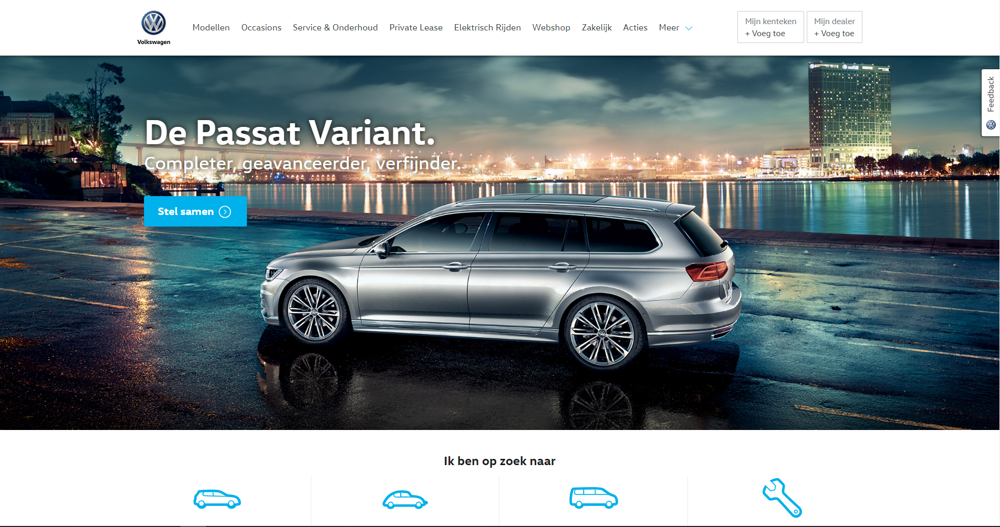
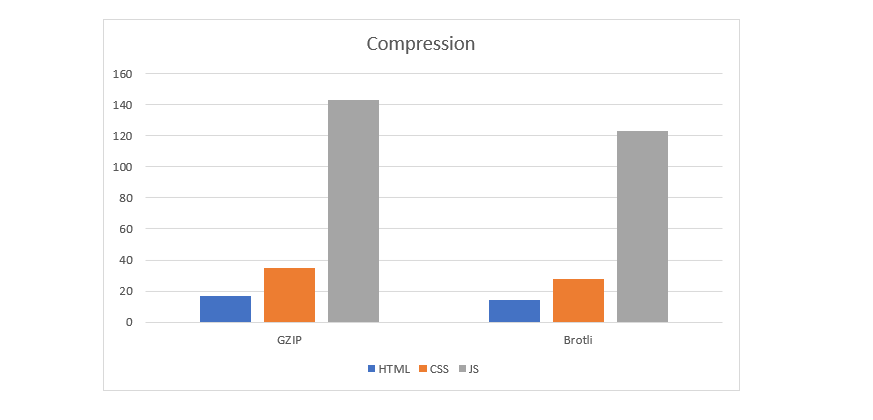
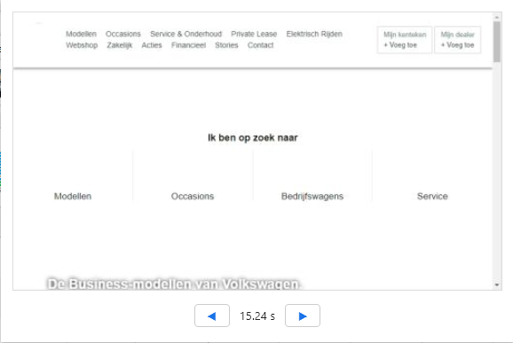
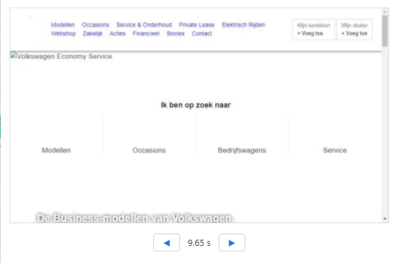
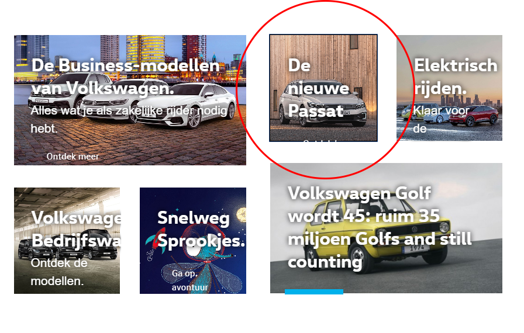

# Project 2 @cmda-minor-web · 2018-2019

## Introduction
This readme contains the research I have done on the volkswagen.nl website concerning performance enhancement and accessibility.



## Table of Contents

- [Optimizations](#optimizations)
  - [Compression](#compression)
      - [No compression](#no-compression)
      - [GZIP](#gzip)
      - [Brotli](#brotli)
   - [Font Swapping](#font-swapping)
   - [Keyboard Only](#keyboard-only)
   - [Caching Policy](#caching-policy)
- [Checklist](#checklist)
- [License](#license)

## Optimizations
I made a top 5 of different optimizations that are either huge gains or really easy to implement (or both).

1. **Compression** - The website already uses compression in the form of GZIP. But there is a better optimised way to do it with Brotli. Really easy to implement. 
2. **Font swapping** - Showing fallback fonts until custom font is loaded. Really easy to implement.
3. **Jpeg -> Webp** - Web friendly format for images. Makes them much, much smaller. Might take some time to implement.
4. **Keyboard only** - Make sure to use focus css so people who can't use their mouse can navigate the pages.
5. **Caching policy** -  Cache the resources so the repeat view loads faster.

### Compression

Compression is important in reducing the bite size for your website. The Volkswagen website already uses GZIP to greatly reduce this. But with Brotli the bite size gets even more reduced. I placed this in my number one spot because, even though the reduction may not seem so big, it is really easy to implement. Implementing Brotli should not take longer than an hour.

#### No compression
- HTML 106kb 
- CSS 279kb 
- JS 470kb 

#### GZIP
- HTML 17.1kb | 83.88% Compressed
- CSS 34.9kb | 87.5% Compressed
- JS 143kb | 69.58% Compressed

#### Brotli
- HTML 14.2kb | 86.61% Compressed
- CSS 27.6kb | 90.11% Compressed
- JS 123kb | 73.83% Compressed



### Font Swapping

With font swapping you make sure that it doesn't take to long before the text in your website becomes visible. On slow 3G internet connections users may be forced to wait for more than 15 seconds before the custom fonts are loaded. If you don’t use font swapping it will take this long before any text is visible. With font swapping you can reduce this waiting time and show the fallback fonts until the custom fonts are loaded. Making the perceived performance much better. To implement this you only need to add `font-display: swap;` to all `@font-face` rules like so:

```css
@font-face {
    font-family: VWHeadWeb;
    src: url(../../../Fonts/VW-PKW/VWHeadWeb-Light.woff2) format("woff2"), 
         url(../../../Fonts/VW-PKW/VWHeadWeb-Light.woff) format("woff");
    font-weight: 300;
    font-style: normal;
    font-display: swap;
}
```


### Keyboard Only
For users that are, for whatever reason, unable to use their mouse the focus selector in css is very important. It lets the user know where on the page they are. In the current website this works for the menu in the header and the footer. But it doesn't work for the different images that are also clickable. I fixed this, rather crudely, like so:
```css
*:focus {
    border: .1em solid black;
}

* {
    border: .1em solid transparent;
}
```



Now you have a border on everything that you are focused on. This might not be needed but it shows how important it is to know you are. Preferably a designer makes a nice focus design, which the developer will implement on the different elements.

### Caching Policy
What I also noticed the website has many third party scripts that use bandwidth to load. Your own html, css and javascript files use caching headers. It would be nice to use the same caching policy for those third party scripts. Be it by caching headers or by adding a service worker that caches those files. This way the repeat visits would be much, much faster. Implementing this may take some effort though, if at all possible.

## License 
See the [LICENSE file](https://github.com/Mennauu/web-app-from-scratch-18-19/blob/master/LICENSE) for license rights and limitations (MIT).
